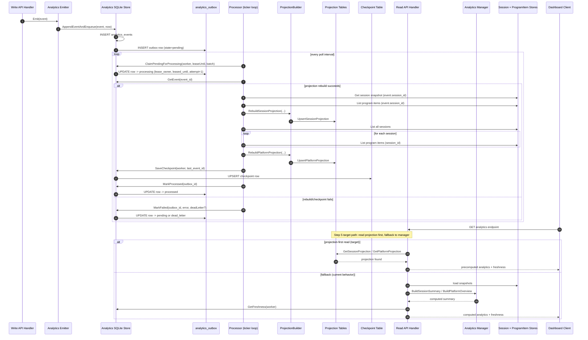
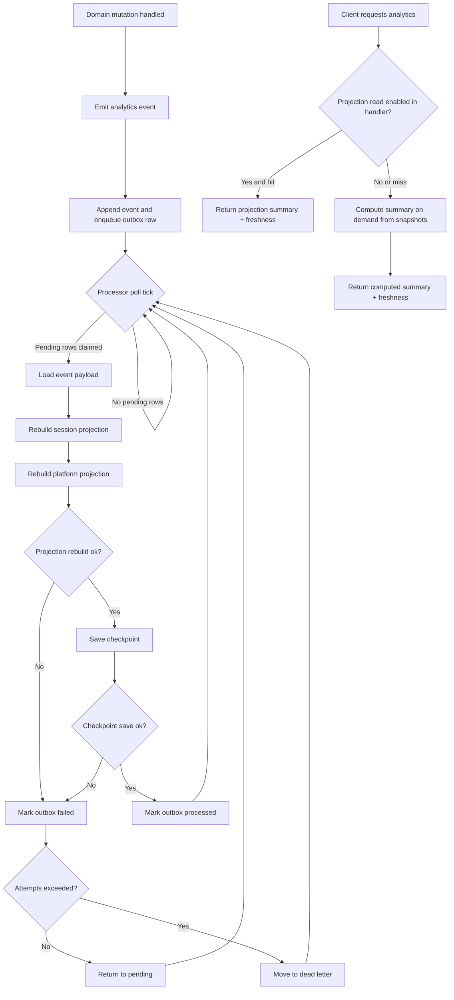

# Analytics Ingestion To Output Flow

This document shows the end-to-end analytics flow from event ingestion to API output.

## Sequence Diagram

## Activity Diagram

## Notes

- Outbox leasing prevents duplicate simultaneous processing in a single-node deployment model.
- Checkpoint tracks worker progress by last processed event id.
- Dead-letter rows represent events that exceeded retry attempts.
- Projection rebuild currently happens before checkpoint save and outbox processed state transition.
